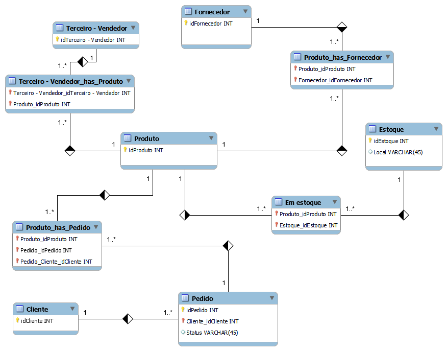
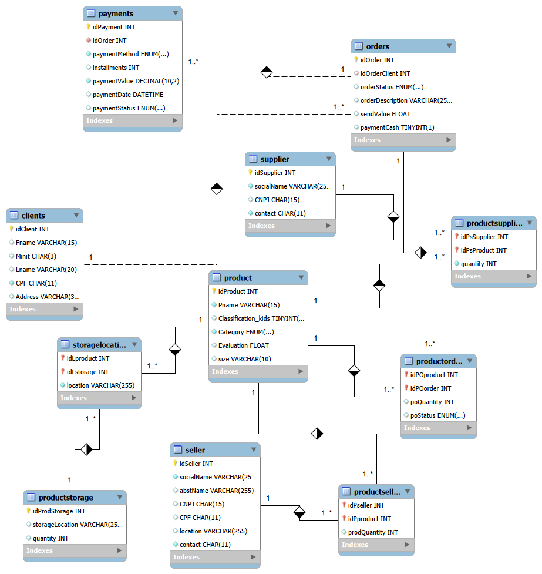
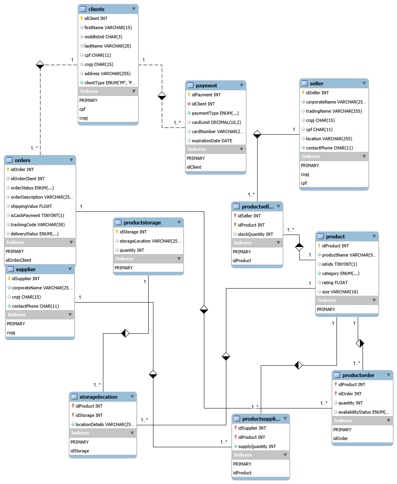

# 🛒 E-Commerce Database Project

## 📋 Descrição do Projeto

Este projeto faz parte de um desafio de banco de dados SQL, onde foram desenvolvidos dois esquemas de banco de dados para um cenário de **e-commerce**. O objetivo foi modelar, implementar e refinar um banco de dados relacional que atenda às necessidades de uma plataforma de vendas online, incluindo gestão de clientes, produtos, pedidos, pagamentos, estoques, fornecedores e vendedores.

---

## 🗂️ Estrutura do Projeto
```
├── ecommerce/ # Versão inicial do banco de dados
│ ├── schema.sql # Script de criação das tabelas
│ ├── inserts.sql # Dados de exemplo
│ └── queries.sql # Consultas SQL avançadas
│
├── finest_ecommerce/ # Versão refinada (melhores práticas)
│ ├── schema.sql # Script com nomes em inglês e validações
│ ├── inserts.sql # Dados de exemplo (incluindo PJ/PF)
│ └── queries.sql # Queries com cláusulas complexas
│
├── images/ # Diagramas ER
│ ├── ecommerce_er.png # Diagrama ER da versão original
│ └── finest_ecommerce_er.png # Diagrama ER da versão refinada
│
└── README.md # Este arquivo
```
---

## 📊 Versão 1: E-Commerce Base

### Modelo Conceitual

O primeiro banco de dados (`ecommerce`) foi desenvolvido para atender às necessidades básicas de um e-commerce, com as seguintes entidades principais:

- **Clients**: Cadastro de clientes (apenas PF inicialmente)
- **Product**: Catálogo de produtos
- **Orders**: Pedidos realizados
- **Payments**: Formas de pagamento
- **Supplier**: Fornecedores
- **Seller**: Vendedores terceiros
- **ProductStorage**: Controle de estoque

### Diagrama ER Original



### Diagrama ER Reproduzido



### Características

- Chaves primárias e estrangeiras implementadas
- Constraints de unicidade (CPF, CNPJ)
- Enums para status e categorias
- Relacionamentos N:N (productSeller, productOrder, storageLocation)

### Script de Criação (Trecho)

```sql
-- Tabela cliente (versão original)
CREATE TABLE clients(
    idClient INT AUTO_INCREMENT PRIMARY KEY,
    Fname VARCHAR(15),
    Minit CHAR(3),
    Lname VARCHAR(20),
    CPF CHAR(11) NOT NULL,
    Address VARCHAR(30),
    CONSTRAINT unique_cpf_client UNIQUE(CPF)
);

-- Tabela produto
CREATE TABLE product(
    idProduct INT AUTO_INCREMENT PRIMARY KEY,
    Pname VARCHAR(15) NOT NULL,
    Classification_kids BOOLEAN DEFAULT FALSE,
    Category ENUM('Eletronicos', 'Roupas', 'Brinquedos', 'Alimentos', 'Moveis') NOT NULL,
    Evaluation FLOAT DEFAULT 0,
    size VARCHAR(10)
);
```
### Exemplo de Consulta

```sql
-- Relação completa de produtos, fornecedores e estoques
SELECT p.Pname AS produto,
       s.socialName AS fornecedor,
       ps.quantity AS quantidade_fornecida,
       pst.storageLocation AS local_estoque
FROM product p
JOIN productSupplier ps ON p.idProduct = ps.idPsProduct
JOIN supplier s ON ps.idPsSupplier = s.idSupplier
LEFT JOIN storageLocation sl ON p.idProduct = sl.idLproduct
LEFT JOIN productStorage pst ON sl.idLstorage = pst.idProdStorage;
```

## ✨ Versão 2: Finest E-Commerce (Refinado)

Melhorias Implementadas
O banco finest_ecommerce é uma evolução do primeiro modelo, aplicando melhores práticas de modelagem e refinamentos solicitados no desafio:

Aspecto	Versão Original	Versão Refinada
Nomenclatura	Mistura português/inglês	100% inglês (boas práticas)
Tipo de Cliente	Apenas PF	PF e PJ (com validação)
Pagamento	Uma forma por cliente	Múltiplas formas de pagamento
Entrega	Sem rastreamento	Código de rastreio e status detalhado
Validações	Básicas	CHECK constraints (CPF/CNPJ)
Novas Funcionalidades

### 1. Cliente PF e PJ
```sql
CREATE TABLE clients (
    idClient INT AUTO_INCREMENT PRIMARY KEY,
    firstName VARCHAR(15),
    middleInit CHAR(3),
    lastName VARCHAR(20),
    cpf CHAR(11) UNIQUE,
    cnpj CHAR(15) UNIQUE,
    address VARCHAR(255),
    clientType ENUM('PF', 'PJ') NOT NULL,
    CONSTRAINT check_cpf_cnpj CHECK (
        (clientType = 'PF' AND cpf IS NOT NULL AND cnpj IS NULL) OR
        (clientType = 'PJ' AND cnpj IS NOT NULL AND cpf IS NULL)
    )
);
```

### 2. Múltiplas Formas de Pagamento
```sql
CREATE TABLE payment (
    idPayment INT AUTO_INCREMENT PRIMARY KEY,
    idClient INT NOT NULL,
    paymentType ENUM('Credit Card', 'Debit Card', 'Boleto', 'Pix', 'Cash') NOT NULL,
    cardLimit DECIMAL(10,2),
    cardNumber VARCHAR(20),
    expirationDate DATE,
    FOREIGN KEY (idClient) REFERENCES clients(idClient)
);
```

### 3. Entrega com Rastreamento
```sql
CREATE TABLE orders (
    idOrder INT AUTO_INCREMENT PRIMARY KEY,
    idOrderClient INT,
    orderStatus ENUM('Processing', 'Confirmed', 'Cancelled', 'Delivered') DEFAULT 'Processing',
    orderDescription VARCHAR(255),
    shippingValue FLOAT DEFAULT 10,
    isCashPayment BOOLEAN DEFAULT FALSE,
    trackingCode VARCHAR(50),
    deliveryStatus ENUM('Order placed', 'Separating', 'Shipped', 'In transit', 'Delivered') DEFAULT 'Order placed',
    FOREIGN KEY (idOrderClient) REFERENCES clients(idClient)
);
```

### Diagrama ER Refinado



## Inserção de Dados (Exemplo)
```sql
-- Inserindo clientes PF e PJ
INSERT INTO clients (firstName, middleInit, lastName, cpf, cnpj, address, clientType) VALUES
('João', 'S', 'Silva', '12345678901', NULL, 'Rua A, 123', 'PF'),
('Maria', 'A', 'Oliveira', '23456789012', NULL, 'Av B, 456', 'PF'),
('Empresa XYZ', NULL, NULL, NULL, '12345678000199', 'Rodovia C, 1000', 'PJ');

-- Inserindo múltiplas formas de pagamento para um mesmo cliente
INSERT INTO payment (idClient, paymentType, cardLimit, cardNumber, expirationDate) VALUES
(1, 'Credit Card', 5000.00, '1111222233334444', '2028-12-31'),
(1, 'Pix', NULL, NULL, NULL);
```

## 📝 Consultas SQL Implementadas
Ambas as versões incluem queries com as seguintes cláusulas:
Cláusula	Exemplo de Pergunta
SELECT simples	Listar todos os produtos disponíveis
WHERE	Filtrar produtos infantis com avaliação > 4
Atributos derivados	Calcular valor total do pedido (produtos + frete)
ORDER BY	Ordenar produtos por avaliação (melhores primeiro)
HAVING	Clientes que fizeram mais de 1 pedido
JOINs complexos	Relação produtos × fornecedores × estoques
Query 1: Recuperação Simples com SELECT
sql
-- Pergunta: Quais são todos os produtos disponíveis na loja?
SELECT idProduct, productName, category, rating FROM product;
Query 2: Filtros com WHERE
sql
-- Pergunta: Quais produtos são infantis e têm avaliação acima de 4 estrelas?
SELECT productName, rating FROM product 
WHERE isKids = TRUE AND rating > 4.0;
Query 3: Atributos Derivados
sql
-- Pergunta: Qual o valor total de cada pedido (produtos + frete)?
SELECT o.idOrder, 
       SUM(po.quantity * p.rating) AS subtotal_produtos,
       o.shippingValue AS frete,
       (SUM(po.quantity * p.rating) + o.shippingValue) AS valor_total
FROM orders o
JOIN productOrder po ON o.idOrder = po.idOrder
JOIN product p ON po.idProduct = p.idProduct
GROUP BY o.idOrder;
Query 4: Ordenação com ORDER BY
sql
-- Pergunta: Produtos ordenados por avaliação (do melhor ao pior)
SELECT productName, rating FROM product ORDER BY rating DESC;
Query 5: Filtro com HAVING
sql
-- Pergunta: Clientes que fizeram mais de 1 pedido
SELECT c.idClient, c.firstName, COUNT(o.idOrder) AS total_pedidos
FROM clients c
JOIN orders o ON c.idClient = o.idOrderClient
GROUP BY c.idClient
HAVING COUNT(o.idOrder) > 1;
Query 6: Junção Complexa (Destaque)
sql
-- Pergunta: Quais produtos cada fornecedor entrega e onde estão estocados?
SELECT 
    p.productName AS produto,
    s.corporateName AS fornecedor,
    ps.supplyQuantity AS quantidade_fornecida,
    pst.storageLocation AS armazem,
    sl.locationDetails AS localizacao
FROM product p
JOIN productSupplier ps ON p.idProduct = ps.idProduct
JOIN supplier s ON ps.idSupplier = s.idSupplier
LEFT JOIN storageLocation sl ON p.idProduct = sl.idProduct
LEFT JOIN productStorage pst ON sl.idStorage = pst.idStorage
ORDER BY p.productName;
Query 7: Verificar se Vendedor também é Fornecedor
sql
-- Pergunta: Existem vendedores que também atuam como fornecedores?
SELECT s.corporateName AS nome_vendedor, s.cnpj
FROM seller s
WHERE s.cnpj IN (SELECT cnpj FROM supplier);
🚀 Como Executar o Projeto
Pré-requisitos
MySQL Server 8.0+

MySQL Workbench (recomendado para visualização dos diagramas)

Passo a Passo
Clone o repositório

bash
git clone https://github.com/seu-usuario/ecommerce-database.git
cd ecommerce-database
Execute o script de criação (versão refinada)

sql
SOURCE finest_ecommerce/schema.sql;
Carregue os dados de exemplo

sql
SOURCE finest_ecommerce/inserts.sql;
Teste as consultas

sql
SOURCE finest_ecommerce/queries.sql;
Gerando o Diagrama ER no MySQL Workbench
Abra o MySQL Workbench

Conecte ao seu banco de dados

Vá em Database → Reverse Engineer

Selecione o schema finest_ecommerce

Conclua o assistente para gerar o diagrama automaticamente

Exporte como PNG: File → Export → PNG

📈 Possíveis Evoluções
Implementar triggers para atualizar estoque automaticamente

Criar stored procedures para relatórios gerenciais

Adicionar índices para otimização de consultas

Implementar soft delete (flag active)

Criar views para relatórios frequentes

Adicionar auditoria com tabelas de log

Implementar cache de consultas frequentes

🎯 Aprendizados e Boas Práticas Aplicadas
Conceito	Aplicação no Projeto
Normalização	Dados organizados em tabelas relacionadas evitando redundância
Integridade Referencial	Chaves estrangeiras com ON DELETE/UPDATE CASCADE
Nomenclatura em Inglês	Padrão internacional para portabilidade do código
Constraints de Validação	CHECK para garantir CPF/CNPJ correto conforme tipo de cliente
Enums	Status e categorias com valores pré-definidos e controlados
Relacionamentos N:N	Tabelas de ligação (productSeller, productSupplier, storageLocation)
Atributos Derivados	Cálculo de valor total do pedido em tempo de consulta
📊 Modelo Lógico - Resumo das Tabelas
Tabelas Principais
Tabela	Descrição	Chave Primária
clients	Cadastro de clientes (PF e PJ)	idClient
product	Catálogo de produtos	idProduct
orders	Pedidos realizados	idOrder
payment	Formas de pagamento dos clientes	idPayment
supplier	Fornecedores de produtos	idSupplier
seller	Vendedores terceiros	idSeller
productStorage	Locais de estoque	idStorage
Tabelas de Relacionamento (N:N)
Tabela	Relacionamento
productOrder	Produtos × Pedidos
productSupplier	Produtos × Fornecedores
productSeller	Produtos × Vendedores
storageLocation	Produtos × Estoque
❓ Perguntas de Negócio Respondidas pelas Queries
Pergunta	Query correspondente
Quantos pedidos foram feitos por cada cliente?	Query com HAVING (clientes com >1 pedido)
Algum vendedor também é fornecedor?	Subconsulta comparando CNPJ
Relação de produtos, fornecedores e estoques	Junção complexa (6 tabelas)
Qual o valor total de cada pedido?	Atributo derivado com SUM
Quais os produtos mais bem avaliados?	ORDER BY rating DESC
Produtos infantis com boa avaliação?	WHERE com isKids e rating
Qual a forma de pagamento mais usada?	(Pode ser adicionada facilmente)
🛠️ Tecnologias Utilizadas
MySQL - Sistema de Gerenciamento de Banco de Dados

MySQL Workbench - Modelagem e execução de queries

Git & GitHub - Versionamento e hospedagem do código

Markdown - Documentação do projeto

📚 Referências
MySQL Documentation

Desafio de Projeto - DIO

Best Practices for Database Naming

SQL Constraints Guide

👩‍💻 Autor
Desenvolvido como parte do desafio de banco de dados SQL.

Plataforma: DIO (Digital Innovation One)

Tecnologias: MySQL, SQL Workbench

Data: Abril/2026

📄 Licença
Este projeto está sob a licença MIT. Consulte o arquivo LICENSE para mais informações.

💬 Contato
Dúvidas ou sugestões? Fique à vontade para abrir uma Issue no repositório!

🙏 Agradecimentos
À DIO pelo desafio proposto

À comunidade de desenvolvedores SQL

A todos que contribuíram com feedbacks e sugestões
